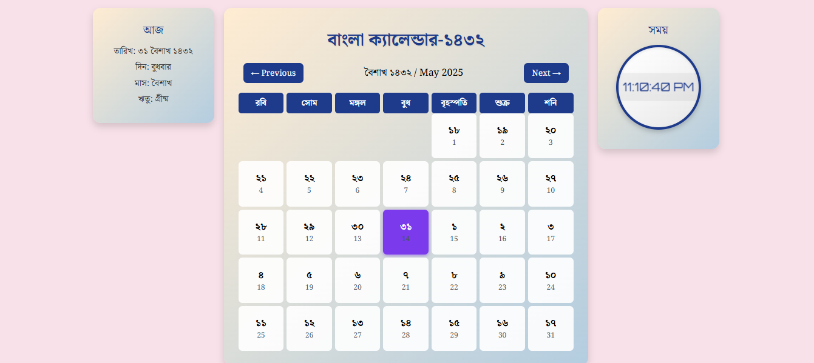

<div align="center">

# 🌼 Bangla Calendar

 
 


</div>

A **sophisticated**, **beautiful**, and **responsive** web application that displays the **Bangla calendar** with accurate dates, months, seasons, and real-time clock — all in Bangla numerals and language. It precisely converts Gregorian dates to Bangla dates and presents the data in an elegant, user-friendly interface with enhanced visual elements.

This project focuses on correctness, performance, and delightful UI/UX on both mobile and desktop devices. Recent updates include compressed mobile layout, improved typography, and dynamic footer versioning.

🔗 **Live Demo**: [Bangla Calendar](https://banglacalendar.netlify.app/)

---

## 📚 Table of Contents

1. [Features](#-features)
2. [Screenshots](#-screenshots)
3. [Tech Stack](#-tech-stack)
4. [How It Works](#-how-it-works)
5. [Getting Started](#-getting-started)
6. [Usage Guide](#-usage-guide)
7. [Customization](#-customization)
8. [Accessibility](#-accessibility)
9. [Performance Optimizations](#-performance-optimizations)
10. [Roadmap](#-roadmap)
11. [Project Structure](#-project-structure)
12. [Contributing](#-contributing)
13. [Developer Info](#-developer-info)
 14. [License](#-license)


## ✨ Features

* 📅 **Accurate Bangla Calendar** – Clean monthly calendar showing correct Bangla dates with month transitions.
* 🔄 **Precision Date Conversion** – Advanced algorithm for accurate Gregorian to Bangla date conversion.
* 📌 **Enhanced Today's Info** – Displays today's Bangla date with proper ordinals (২রা), day name, month, and year (বঙ্গাব্দ).
* 🌓 **Dual Month Display** – Shows current and upcoming Bangla months in the header (e.g., ভাদ্র / আশ্বিন).
* 🗓️ **Month-Aware Calendar** – Calendar cells accurately show which Bangla month each date belongs to.
* 🕰️ **Real-Time Clock** – Stylish digital clock showing Dhaka time, updated every second.
* 📱 **Responsive Design** – Seamlessly works across mobile, tablet, and desktop (with custom mobile compression logic for small heights and narrow screens).
* 💫 **Smooth Animations** – Elegant slide transitions while switching between months.
* 🎨 **Enhanced UI** – Gradient effects, improved typography, and visual highlights.
* 🧭 **Current Season Indicator** – Shows Bengali season (ঋতু) dynamically.
* 🧪 **Self-Contained** – No build pipeline needed; open `index.html` and go.
* 🆔 **Auto Version Footer** – Footer shows current Gregorian year, Bangla year, and a dynamic date-based version (YYYY.MM.DD).

## 📸 Screenshots

### Homepage


## 🛠️ Tech Stack

| Technology             | Purpose                                        |
| ---------------------- | ---------------------------------------------- |
| **HTML5**              | Semantic page structure                        |
| **Tailwind CSS**       | Responsive and modern styling with utility classes |
| **Custom CSS**         | Advanced animations, transitions, and visual effects |
| **JavaScript (ES6+)**  | Complex calendar logic, date conversions, dynamic updates |
| **Date API**           | Precision timezone handling and date calculations |
| **Noto Serif Bengali** | High-quality Bangla font rendering             |
| **Orbitron**           | Modern digital clock design font               |
| **CSS Grid/Flexbox**   | Advanced responsive layout techniques          |
| **CSS Custom Props**   | Dynamic theming capabilities                   |
| **Responsive Media Queries** | Mobile layout compression & spacing adjustments |
| **Netlify**            | Optimized hosting with continuous deployment   |

## ⚙️ How It Works

* **Advanced Date Conversion** - Uses a custom algorithm (no external libs) to map Gregorian dates to Bangla calendar system.
* **Month Transition Awareness** - Correctly identifies when dates transition from one Bangla month to another (typically mid-month in the Gregorian calendar).
* **Proper Ordinals** - Displays Bangla dates with appropriate ordinals (e.g., ১লা, ২রা, ৩রা, ৪ঠা).
* **Dual-Calendar System** - Shows both Bangla dates and corresponding Gregorian dates in each cell.
* **Dynamic Month Headers** - Automatically updates the header to show the two Bangla months that overlap with the current Gregorian month.
* **Today Highlighting** - Visual indication of the current date with enhanced styling.
* **Seasonal Information** - Displays the current Bangla season (ঋতু) based on the month.
* **Timezone-Specific Clock** - Precise **Asia/Dhaka** timezone clock with automatic updates.
* **Smooth Navigation** - Elegant transitions when moving between months with history-aware navigation.

## 🚀 Getting Started

### 1. Clone the Repository

```bash
git clone https://github.com/anowarohossain/bangla-calendar.git
```

### 2. Navigate to Project Directory

```bash
cd bangla-calendar
```

### 3. Open the App

Option A: Directly open `index.html` in your browser.

Option B: Use a lightweight local development server:

```bash
npm install -g live-server
live-server
```

> ⚠️ No external build tools required. Tailwind CSS is included via CDN, and fonts are loaded from Google Fonts.

## 💡 Usage Guide

| Action          | Description                                                |
| --------------- | ---------------------------------------------------------- |
| View Calendar   | Open the app to see the current month with accurate Bangla dates and month transitions |
| Navigate Months | Use **Previous** and **Next** buttons to explore different months with correct Bangla mapping |
| Today's Info    | Check the **Today** section for current Bangla date with proper formatting (e.g., বুধবার ২রা আশ্বিন ১৪৩২ বঙ্গাব্দ) |
| Month Headers   | Notice how the two Bangla months in the header change as you navigate (e.g., ভাদ্র / আশ্বিন) |
| Date Details    | Each cell shows both the Bangla date and its corresponding Gregorian date |
| Month Labels    | Each date displays which Bangla month it belongs to (helpful for transition periods) |
| Real-Time Clock | Watch the precision Bangladesh time clock update every second |
| Seasonal Info   | View the current Bangla season (ঋতু) information |
| Mobile Ready    | Experience a fully responsive layout optimized for all devices |

## 🛠 Customization

You can quickly tweak look & feel without touching logic:

| Area | How |
| ---- | ---- |
| Colors / gradients | Edit top-level gradients in `styles.css` (`body`, `.calendar-container`) |
| Font sizes | Adjust media query blocks (`@media (max-width: 768px)` etc.) |
| Hide Bangla month inside cells | Remove the `<div class="text-xs text-pink-700">` line in `calendar.js` inside `renderCalendar()` |
| Change footer versioning | Replace the version logic in `index.html` footer script |
| Default starting month | Set `currentMonth` / `currentYear` at top of `calendar.js` |
| Add holidays | After populating a day cell in `renderCalendar()`, append a class if date matches holiday list |

### Adding a Holiday Highlight Example
```javascript
// inside renderCalendar() loop after creating `cell`
const holidayMap = { '4-14': 'pohela-boishakh' }; // MM-DD : class
const key = `${String(currentMonth+1)}-${d}`;
if (holidayMap[key]) cell.classList.add(holidayMap[key]);
```
Add styling for `.pohela-boishakh` in `styles.css`.

## ♿ Accessibility

| Aspect | Status / Notes |
| ------ | -------------- |
| Language attribute | `lang="bn"` set in `index.html` |
| Color contrast | Dark-on-light & gradient tested for readability |
| Keyboard nav | Static app (no tabindex needed yet); can add focus styles later |
| ARIA roles | Could add `role="grid"` + `role="gridcell"` for better screen reader semantics |
| Fonts | Bengali glyph coverage via Noto Serif Bengali |

Potential improvements: Add skip links, semantic button labels with `aria-label` for navigation, and a high-contrast mode toggle.

## 🚀 Performance Optimizations

* Minimal JavaScript (single file, no framework)
* No blocking large assets (fonts + Tailwind CDN)
* Lightweight DOM updates (regen calendar on month change only)
* Mobile-specific spacing rules reduce scroll height

## 🧭 Roadmap

- [ ] Add optional holiday dataset & highlighting
- [ ] Add offline font fallback (self-host Noto Serif Bengali subset)
- [ ] Add PWA manifest + service worker for installability
- [ ] Add print view / export to PDF
- [ ] Add dark mode toggle
- [ ] Add accessibility roles & keyboard navigation
- [ ] Add mini date converter input widget

## 📁 Project Structure

bangla-calendar/  
├── index.html          # Main HTML structure with responsive layout  
├── styles.css          # Enhanced styling with animations and visual effects  
├── calendar.js         # Advanced calendar logic with precise date conversion  
├── sitemap.xml         # SEO optimization for search engines  
├── assets/             # Images and additional resources  
└── README.md           # Project documentation

## 🤝 Contributing

Contributions are welcome! Follow these simple steps:

1. **Fork** the repository
2. Create a **new branch**

   ```bash
   git checkout -b feature-name
   ```
3. **Commit** your changes

   ```bash
   git commit -m "Add feature"
   ```
4. **Push** to your branch

   ```bash
   git push origin feature-name
   ```
5. Open a **Pull Request**

> Please maintain code style consistency and add helpful comments.

### � Resources

| Document | Purpose |
| -------- | ------- |
| [CONTRIBUTING.md](CONTRIBUTING.md) | How to set up environment, commit guidelines, PR checklist |
| [CODE_OF_CONDUCT.md](CODE_OF_CONDUCT.md) | Expected behavior and enforcement |
| [Issue Templates](./.github/ISSUE_TEMPLATE) | Standardized bug/feature submission forms |
| [Pull Request Template](./.github/pull_request_template.md) | Ensures consistent review quality |

If unsure about an idea, open an issue first to discuss.

## �👤 Developer Info

**👨‍💻 Developed by**: Anowar Hossain  

📧 **Email**: [anowarhossain.dev@gmail.com](mailto:anowarhossain.dev@gmail.com)  
🌐 **GitHub**: [Anowar Hossain](https://github.com/anowarohossain)

---

### ⭐ Support
If this project helps you, please consider starring the repo — it helps visibility and motivates future improvements!

### 📝 License
Released under the MIT License. Feel free to use, modify, and distribute with attribution.

---

## 🪪 License

This project is licensed under the **MIT License** – see the [LICENSE](LICENSE) file for details.

## 🚀 Upcoming Features

- [ ] Dark mode toggle
- [ ] Bangla ↔ Gregorian date converter
- [ ] Holiday highlighting
- [ ] Language switcher (Bangla/English)
- [ ] Responsive mobile layout
- [ ] Event reminder notifications
